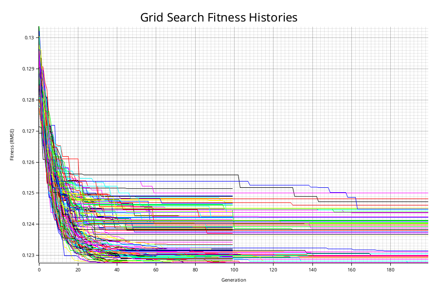

# Parameters and result with elitism



### Grid search configuration:
```rust
    let pop_sizes = [100, 200, 300];
    let gen_sets = [100, 200];
    let t_sizes = [3, 5];
    let c_rates = [0.7, 0.9];
    let m_rates = [0.05, 0.01];
```

### Results
```bash
Best RMSE: 0.122760
Best params: (100, 200, 3, 0.9, 0.01, 5)
Memory usage: 124.35 MB
Total running time: 1874.03s
```