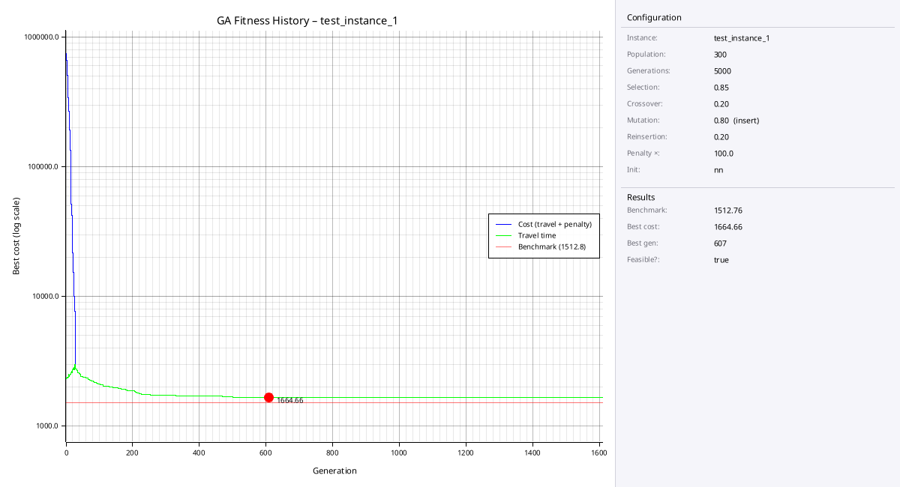
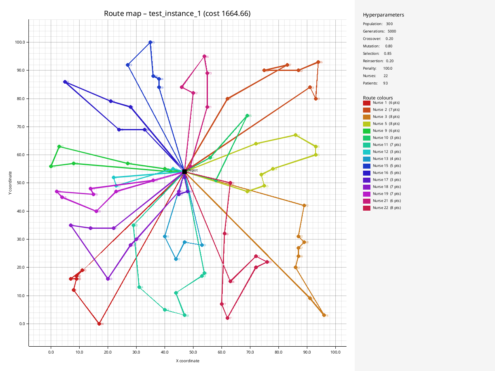
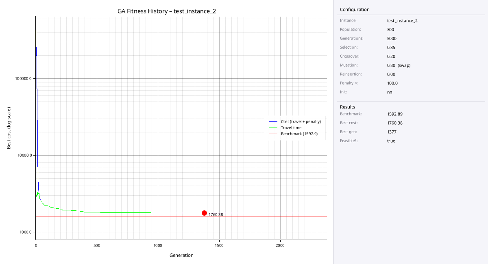
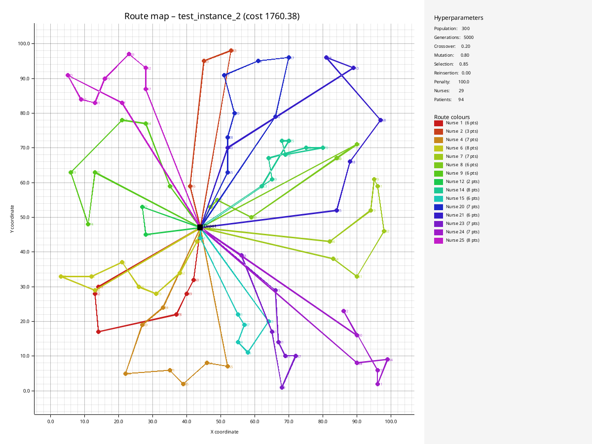
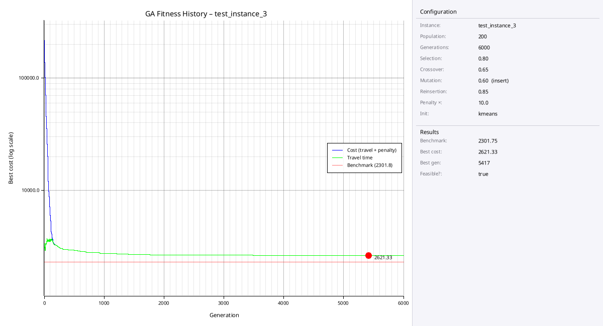
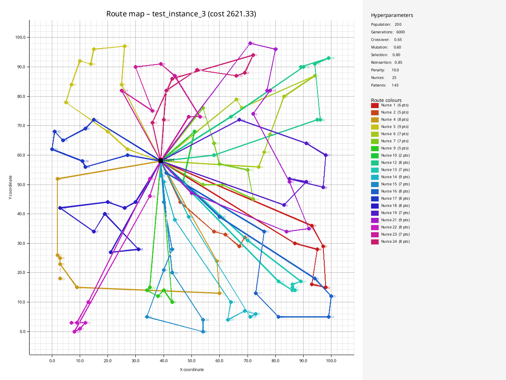

# IT3708 Bioinspired Artificial Intelligence
## Project 2: Optimizing the Home Care Service

Date: 08.03.2026

The group has consisted of:

- Thomas Hansen [\<thomasq@stud.ntnu.no\>](mailto:thomasq@stud.ntnu.no)

## Project Setup
As I took this course also last year, I have based my solution on the code we developed for that, in Julia. I have converted major parts of the code to Rust, using Github Copilot for assistance. Instead of relying on hand-coded GA run logic, I wanted to see if using a library could help. I opted for the Genevo crate (https://crates.io/crates/genevo). Most "boiler-plate" code has been generated by CP, as I considered it not to be what this assignment is about, and rather focused on experimenting with different approaches to optimizing the problem solution.

I used the Rayon crate to parallelize execution of the fitness evaluations, but realized that it was creating more overhead than it was saving time, due to massive context switching. If the fitness evaluation function had been more expensive, it could possibly have been efficient, but I took out Rayon and relied on single-threaded fitness evaulation with caching instead.

There are still traces of thread-safety code in the solution.

## Methodology

### Configuration
This GA has been built as configurable both from the CLI and using a config file. This allows for quick experimentations and also keeping the configurations and plots of the best results. 

One config option is the RNG seed (`random_seed`). If set statically, it will make the run deterministic and reproduce the exact same result every time. This is good for comparisons.

### Problem file parsing
> I caught the notice about test-instance files with float values too late, so my solution parses as float and uses floats throughout the code. I don't think this has a major performance impact.

Files are well-structured JSON format. I store the data in a `ProblemContext` containing patient lists.

### The genome
This problem's genome consists of a list of routes of patient visits, one each for a number of nurses. By calculating the travel time of the route, considering time window for care vs arrival time, nurses capacity vs patient demand and arrival time back at the depot, we are to optimize the genome for minimum travel time, while being feasible. Feasibility is reached when all nurses are back at the depot before the deadline, also considering nurses capacity for care.

The Genevo library has a `GenomeBuilder` which initializes population, and by implementing for that, I built specialized genome builder's for each type of population initialization.

In short, a population is a "vector of vectors of integers" where the integers are the patient's ID; `Vec<Vec<usize>>` in Rust.

Each GenomeBuilder implementation has the genomes placed in a context struct which is wrapped in shared, read-only `Arc<T>` structs, to allow multi-threading if needed.

### Population initialization
There are four different methods available; `random`, `nn`, `cw` and `kmeans`.

#### **Random** 
Will create a population with a shuffled list of patients, then divide them equally among the nurses.

#### **Nearest Neighbor (nn)** 
Will start by assigning a random patient to each nurse, then calculating the distance to other patients, place the nearest neighbors in each patient list. The order of the nearest neighbors is not optimal in this case.

#### **Clarke-Wright savings algorithm (cw)**
This is an algorithm I came across on the Internet while researching possible optimizations improvements, see [1]. I used copilot to suggest a Rust implementation as a separate GenomeBuilder, and then implemented this as a configuration option in my solution.

The algorithm works by calculating "savings" $s(i, j)$ for every pair $(i, j)$ of patients where $s(i, j) is a function of the distance between i and j and $D$ is the depot.

$$s(i, j) = d(D, i) + d(D, j) - d(i, j)$$

Then savings are ranked in descending order and route assignment is done such that no constraints are exceeded.

#### **Kmeans clustering (kmeans)**
This method attempts to create an optimal number of clusters and then assigning patients in the same cluster to the same routes.

### GA
The GA uses the scaffolding available from Genevo to run a simulation. It first sets up all the parameters and then loops over what they call "steps" (I would call generations) and produce a result.

We keep track of the best solutions (lowest fitness) and build up history data for plotting.

### Mutation
Mutation is configurable by setting the type and rate. I implemented `swap` and `insert` mutation. The rate is a probability 0-1.

When there are no improvements over 100 generations, hill climbing kicks in to escape local optima. It does this by swapping two random patients within a route, calculating fitness, and if fitness improves, keep that solution.

> This is a mirror of the Julia hill climb functionality we built last year, and is actually implemented in `local_search.rs` together with another method `two-opt()`. Given more time, I would have refactored the solution to try different local searches.

### Tournament selection
For Elitism and tournament selection, I opted to use Genevo's built-in functionality, to see if it would give the intended results.

In the configuration, tournament selection is optional, turning to "truncation" as the other option.

### Crossover
For each pair of parents (genomes) $(P_1, P_2)$, with probability $p$, pick a donor route from $P_2$ and remove those patients from $P_1$. Reinsert orphaned patients into the fittest position in $P_1$, producing child $C_1$. Do the same in the other direction to produce $C_2$.

We have a preference to infeasible routes, to keep pressure on fixing them first. Random route is picked if there are no infeasible routes. 

### Local Search
Local search attempts to rearrange patients within a route to find better solutions. This will help making some initially non-feasible solutions feasible. 

I've implemented two-opt and hill climbing local search. I use two-opt after every cross-over, and also add hill climb after 100 generations without improvement.

### Elitist Reinsertion
The ElitistReinserter combines the best individuals from the offspring and the old population. When there are more individuals in the offspring than necessary, either because the offspring is larger than the population size or a replace ratio smaller then 1.0 is specified, only those individuals with the best fitness are taken over into the new population.

The reinserter can be configured by the `reinsertion_ratio` field in the configuration. The replace ratio is the fraction of the population size that is replaced by individuals from the offspring. The remaining spots are filled with individuals from the old population.

A replace ratio of 1.0 means that the new population is fist filled with individuals from the offspring. If the offspring does not contain enough individuals then the new population is filled up with individuals from the old population. If the offspring contains more individuals than the size of the population then the individuals are chosen uniformly at random.

### Stagnation
When a number of generation without improvement has passed, a percentage of the population is replaced using the same genomebuilder as the main algorithm (either `random`, `nn`, `kmeans` or `cw`).

### Fitness evaluation
> The fitness evaluation is done by a calculation which is deceptively simple, but easy to get wrong. Last year, I voted for a test-driven approach, which would have saved us countless hours of troubleshooting bad code. In part because Julia is 1-indexed, and in part because it's very easy to be "off by one" in code, we struggled to create a correct fitness evaulator, and thus missed the Visma Revolut competition by creating infeasible solutions. Lessons learned.

I wrote the fitness evaluation function on the same foundation as last year's Julia version, but this time I added tests which verify travel cost calculations on a small, manageable dataset.

After I ditched the multithreaded fitness evaluation setup, I added a cache to fitness evaluation, initially improving performance (see the `test_fitness_computation_vs_cache_lookup()` test function) by some small percentage. But later testing shows a negative impact, indicating that other optimizations could have swallowed the initial gain.

### Plotting
For plotting the output, I solicited help from Github copilot. It produces a `fitness.png` and a `routes.png` file.

### Output
Results from runs are stored in separate folders named with timestamp, problem file and a random 4 character alpha-numeric string:
```txt
run_1772893186_train_0_json_gqsi_0.2%/
├── config_input.toml
├── config_used.toml
├── fitness.png
├── routes.png
└── routes.txt
```
For this example, I have manually added "0.2%" as it is a record attempt.

## Experimental setup
For experiments I have run lots of manually configured examples, varying the configuration parameters to find improvements. The different problem files yield different solutions with different parameters, there is no single set of configuration that will be optimal for all datasets.

I have used Github Copilot to create a multi-threaded grid search, testing combinations of hyper-parameters for me. This works quite well for initial testing, but more fine-grained or long running solutions quickly becomes too time-consuming to run.

## Results of experiments

### test_instances/test_instance_1.json
Record result: **10.04%** vs benchmark





[Link to routes.txt](run_1772967104_test_instance_1_json_r4s3_10.04/routes.txt)
```
Nurse capacity: 205
Depot return time: 1204.00
--------------------------------------------------------------------
Nurse  1  143.76  181  d(0) -> 42 (53.04-169.04) [46-522] -> 90 (171.87-259.87) [515-1491] -> 50 (608.00-714.00) [345-1305] -> 88 (716.00-816.00) [765-1769] -> 8 (869.12-956.12) [648-1807] -> 24 (971.12-1044.12) [766-1588] -> d(143.76)
Nurse  2  152.83  115  d(0) -> 83 (53.25-159.25) [39-168] -> 49 (163.73-272.73) [39-353] -> 36 (285.76-356.76) [76-568] -> 82 (364.38-460.38) [676-1412] -> 80 (784.00-860.00) [372-946] -> 87 (868.25-949.25) [791-1523] -> 41 (973.43-1065.43) [488-1471] -> d(152.83)
Nurse  3  158.11  191  d(0) -> 61 (62.94-137.94) [203-977] -> 78 (285.81-349.81) [181-352] -> 62 (369.53-461.53) [182-834] -> 56 (465.66-572.66) [410-1477] -> 67 (575.66-689.66) [725-1127] -> 58 (841.83-937.83) [744-1035] -> 32 (940.66-1029.66) [740-1841] -> 72 (1040.84-1139.84) [509-1342] -> d(158.11)
Nurse  4    0.00     0.00  d(0) -> d(0.00)
Nurse  5  106.12  195  d(0) -> 39 (26.93-105.93) [272-1124] -> 59 (365.32-478.32) [365-601] -> 35 (486.38-569.38) [223-1015] -> 55 (572.38-645.38) [279-663] -> 54 (661.19-776.19) [639-1319] -> 77 (780.66-858.66) [695-1762] -> 65 (862.79-940.79) [735-1583] -> 52 (947.11-1066.11) [620-1512] -> d(106.12)
Nurse  6    0.00     0.00  d(0) -> d(0.00)
Nurse  7    0.00     0.00  d(0) -> d(0.00)
Nurse  8    0.00     0.00  d(0) -> d(0.00)
Nurse  9  99.77  142  d(0) -> 70 (7.07-105.07) [285-992] -> 74 (396.15-491.15) [340-713] -> 92 (515.89-626.89) [418-1187] -> 25 (634.51-723.51) [178-863] -> 43 (731.57-810.57) [621-909] -> 71 (844.70-950.70) [757-1171] -> d(99.77)
Nurse 10  67.04  83  d(0) -> 16 (11.40-85.40) [271-522] -> 85 (370.50-462.50) [372-669] -> 11 (483.85-562.85) [647-1637] -> d(67.04)
Nurse 11  125.03  203  d(0) -> 30 (26.17-129.17) [148-546] -> 84 (273.09-349.09) [71-572] -> 57 (361.13-460.13) [512-638] -> 68 (618.28-694.28) [530-982] -> 2 (702.82-794.82) [521-1264] -> 53 (805.64-920.64) [776-1326] -> 5 (922.05-1009.05) [487-1161] -> d(125.03)
Nurse 12  53.25  64  d(0) -> 20 (4.12-81.12) [274-374] -> 60 (371.88-490.88) [272-573] -> 47 (494.04-587.04) [440-683] -> d(53.25)
Nurse 13  72.46  108  d(0) -> 89 (26.68-90.68) [25-146] -> 4 (96.77-208.77) [682-1391] -> 93 (800.71-898.71) [648-1742] -> 26 (907.65-976.65) [662-1127] -> d(72.46)
Nurse 14    0.00     0.00  d(0) -> d(0.00)
Nurse 15  102.85  150  d(0) -> 29 (31.32-138.32) [152-324] -> 44 (262.00-355.00) [221-1379] -> 34 (357.24-422.24) [370-678] -> 45 (447.04-542.04) [306-1259] -> 19 (553.36-668.36) [614-764] -> d(102.85)
Nurse 16  109.59  112  d(0) -> 48 (20.52-99.52) [61-354] -> 15 (149.00-226.00) [367-720] -> 81 (469.50-574.50) [643-1166] -> 79 (765.46-881.46) [567-904] -> 3 (888.74-954.74) [60-1215] -> d(109.59)
Nurse 17  18.51  62  d(0) -> 23 (2.00-68.00) [182-538] -> 46 (253.10-354.10) [258-574] -> 37 (362.16-442.16) [796-901] -> d(18.51)
Nurse 18  117.31  199  d(0) -> 40 (7.28-105.28) [4-527] -> 75 (127.95-193.95) [432-743] -> 63 (500.83-563.83) [644-1621] -> 69 (721.42-797.42) [628-1030] -> 9 (820.44-936.44) [660-1542] -> 1 (943.52-1025.52) [353-1119] -> 31 (1033.52-1146.52) [762-1792] -> d(117.31)
Nurse 19  99.61  190  d(0) -> 91 (25.00-100.00) [134-626] -> 28 (218.90-280.90) [478-712] -> 18 (553.00-671.00) [572-1733] -> 38 (692.83-789.83) [42-1194] -> 76 (802.87-892.87) [460-912] -> 13 (895.10-984.10) [153-1015] -> 10 (1006.31-1114.31) [486-1406] -> d(99.61)
Nurse 20    0.00     0.00  d(0) -> d(0.00)
Nurse 21  88.99  124  d(0) -> 12 (28.16-101.16) [236-354] -> 6 (313.47-399.47) [321-795] -> 86 (420.60-519.60) [408-930] -> 73 (525.68-618.68) [777-1158] -> 21 (882.00-972.00) [250-1117] -> 14 (993.84-1082.84) [668-1359] -> d(88.99)
Nurse 22  149.43  204  d(0) -> 64 (42.15-121.15) [132-440] -> 51 (223.73-315.73) [68-379] -> 33 (320.20-412.20) [188-1015] -> 7 (416.67-509.67) [633-786] -> 17 (746.59-810.59) [529-1194] -> 27 (815.98-916.98) [198-1298] -> 66 (942.00-1029.00) [464-1504] -> 22 (1047.11-1152.11) [704-1251] -> d(149.43)
--------------------------------------------------------------------
Objective value (total duration): 1664.66
```

### test_instances/test_instance_2.json
Record result: 10.52% vs benchmark





[Link to routes.txt](run_1772978972_test_instance_2_json_ggah_10.52/routes.txt)

### test_instances/test_instance_3.json
Record result: 13.88% vs benchmark





[Link to routes.txt](run_1772806177_test_instance_3_json_cbwl_13.88/routes.txt)

## Limitations and next steps
- More systematic ablation study still needed
- Adaptive parameter control (not fixed rates) could improve robustness
- Better route-level repair operators could reduce infeasible offspring
- Compare against additional baselines (e.g., OR-Tools, pure constructive heuristics)
- Extend reporting with statistical summaries across seeded repeats

## Lessons Learned
- Multithreaded fitness (Rayon) was not beneficial for this evaluator complexity
- Single-threaded evaluation + optional cache was simpler and often faster
- Initialization strategy and local search had larger impact than micro-optimizations
- Testing the fitness function early saved debugging time and increased confidence


## References
[1] https://web.mit.edu/urban_or_book/www/book/chapter6/6.4.12.html

